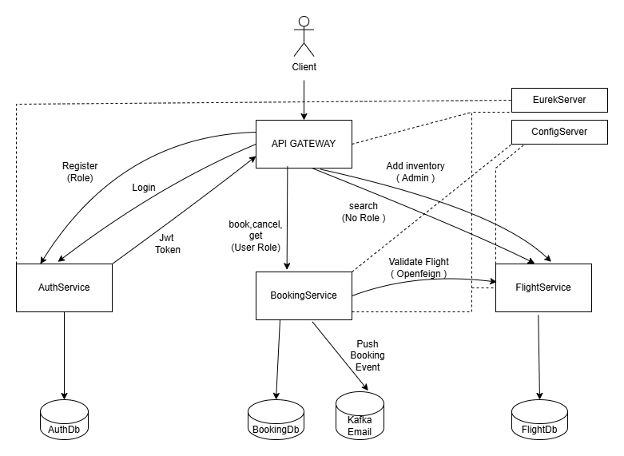

# Flight Booking System using MicroService, MongoDB , Security (Dockerized)

## System Architecture
  

---

## Overview
This project implements a Flight Booking System using Microservices architecture with MongoDB as the database. The system provides various functionalities such as adding User(Role Based), Adding flight inventory, searching for flights, booking tickets, canceling tickets, and retrieving ticket history based on Roles.
   - Have also added basic Producer and Consumer using Kafka.
   - Used OpenFeign for inter-service communication between Booking and Flight services.
   - Used Config Server
   - Used Eureka Server
   - Used Api Gateway 
   - Implemented Security using JWT Token via AuthService
   - And Finally Dockerized the whole Application using Docker.

## 1. Register User (POST /auth/register)
1. Validate user details such as `username`, `password` and `Role`.
2. Check if the username already exists in the database.
3. Assign roles based on the provided `Role` or `ADMIN`.
4. If validation passes, hashed password along with username and passoword is stored user in the database.
5. Return **201 Created** if successful.
6. If any validation fails, return **400 Bad Request**.

## 2. Login User (POST /auth/login)
1. Validate user credentials by using `username` and `password`.
2. If credentials are valid, generate a JWT token.
3. Return the JWT token with **200 OK** if successful.

## 3. addInventory Method  (POST /api/flight/airline/inventory)
1. Check if the user has the `ADMIN` role. If not, return **403 Forbidden**.
2. Then Perform initial validation on `flightNumber`, `date`, `source`, `destination`, etc.  
3. If validation passes, search the `flightInventory` to check if the flight already exists for that date.   
4. If all checks pass:  
   - Add a new `flightInventory` entry and also add the flight if it does not exist.  
5. Return **201 Created** if successful.  
6. If any validation fails, return **400 Bad Request**.  

## 4. searchFlights Method  (POST /api/flight/search)  

1. Perform initial validation on `date`, `source`, `destination`, etc.  
2. Determine if the search is **One-Way** or **Round-Trip**.  
3. For **One-Way**:  
   - Search the inventory for the given `date`, `source`, and `destination`.  
4. For **Round-Trip**:  
   - Search the inventory for both directions (`source → destination` and `destination → source`) for the given start and return dates.  
5. If flights are found, return a list of flights.  
6. If no flights are found, return **404 Not Found**.  

## 5. bookTicket Method  (POST /api/flight/booking/{flightId})
1. Check if the user has the `USER` role. If not, return **403 Forbidden**.
2. Perform initial validation on `seat`, `gender`, etc.  
3. Search the inventory to check if the flight exists (Via OpenFeign).    
4. If all checks pass:  
   - Reduce available seats in the inventory.  
   - Add a new booking and passenger details.  
5. Return the **PNR number** with **201 Created** if successful.  
6. If any validation fails, return **400 Bad Request**.  

## 6. cancelTicket Method  (DELETE /api/flight/booking/cancel/{pnr})
1. Check if the user has the `USER` role. If not, return **403 Forbidden**.
2. Search for the ticket based on `PNR` and status `"BOOKED"`.  
3. If found, check the **24-hour cancellation rule**.  
4. If allowed:  
   - Update ticket status to `"CANCELED"`.  
   - Increase available seats in the inventory.(Via OpenFeign)  
5. Return **200 OK** if successful.  

## 7. getTicket Method  (GET /api/flight/booking/history/{email})
1. Check if the user has the `USER` role. If not, return **403 Forbidden**.
2. Search for tickets based on the user’s email.  
3. If found, return ticket details along with passenger information.  
4. If not found, return **404 Not Found**.  

## 8. getHistory Method  (GET /api/flight/ticket/{pnr})
1. Check if the user has the `USER` role. If not, return **403 Forbidden**.
2. Search for tickets based on the `PNR`.  
3. If found, return ticket details along with passenger information.  
4. If not found, return **404 Not Found**.  

---

## Sonar Qube Report

1. Booking Before:
  

2. Booking After:

3. Flight Before:
  

4. Flight After:

